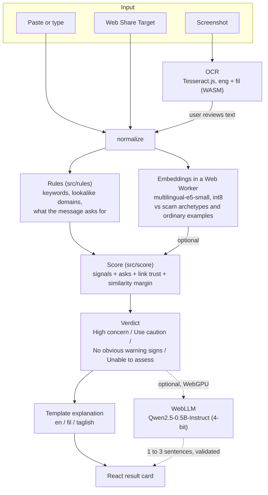

# Sane: private, on-device scam message checker

Sane checks a suspicious text, chat message or screenshot for scam warning signs and tells you
what to do next. Every check runs **inside your browser**: the message never leaves the device,
there is no backend, and after the first visit it works offline.

Built for the AppBuildersPH 2026 **Local AI** hackathon, with a Philippine focus: GCash, Maya and
bank lockouts, parcel fees, fake prizes, task scams, "new number" relatives, government aid and
more, in **English, Filipino and Taglish**.

## What it does

- **Input:** paste or type a message, pick a screenshot (read with on-device OCR), or share text
  to the installed app from another Android app (Web Share Target). Sane does not read your SMS or
  chat apps and does not monitor anything in the background.
- **Verdict:** one of four result cards, each with the red flags found and practical next steps.

  | Result card              | Meaning                                                              |
  | ------------------------ | -------------------------------------------------------------------- |
  | High concern             | Classic scam shape, for example a fake brand link plus a PIN request |
  | Use caution              | At least one real warning sign; check with the sender another way    |
  | No obvious warning signs | Asks for nothing risky, or only points to official domains           |
  | Unable to assess         | Not enough evidence either way; Sane says so instead of guessing     |

- **Optional AI explanation:** on devices with WebGPU, a small language model can add one to three
  sentences of context. It never changes the verdict.
- **Installable PWA:** add to the home screen, relaunch offline, share messages into it.

## Why local AI

Messages people want checked are private: OTPs, bank notices, family chats. Running OCR,
embeddings and the language model on the device means nothing is uploaded, there is no cloud
inference cost or round trip, and the app keeps working with no signal or in airplane mode.

## Architecture

One static website. Code detects facts (links, lookalike domains, code and money requests); the
embedding model adds meaning; the language model only explains.



### Fallback ladder

Every layer can fail without blocking a verdict:

1. Embedding model not loaded or failed: score from rules only (shown in the "AI used" row).
2. Language model unavailable, slow (over 15 s) or unsafe output: template explanation only.
3. OCR fails or reads too little: the user is asked to paste the text.
4. Anything throws: "Unable to assess" with a safe generic tip. Never a blank screen.

### Where models come from

| Component   | Model / library                                         | Size (first visit) | Loaded from                                                         |
| ----------- | ------------------------------------------------------- | ------------------ | ------------------------------------------------------------------- |
| Embeddings  | `Xenova/multilingual-e5-small` int8 via Transformers.js | about 120 MB       | Same origin (`public/models/`), Hugging Face as fallback            |
| OCR         | Tesseract.js with `eng` + `fil` language data           | under 20 MB        | Worker and WASM from same origin; language data cached on first use |
| Explanation | `Qwen2.5-0.5B-Instruct` q4f16 or q4f32 via WebLLM       | about 276 MB       | Hugging Face (MLC builds), on request only                          |

All of it is cached by the browser, so later checks make no network requests.

### Project structure

```text
src/
  main.tsx                 App entry
  types.ts                 Shared contracts (Verdict, Signal, Match, Level)
  pipeline/analyze.ts      Orchestrates OCR, rules, embeddings, scoring and fallbacks
  pipeline/normalize.ts    Unicode cleanup, zero-width removal
  rules/index.ts           Keyword and pattern signals (OTP, fees, prizes, relatives, ...)
  rules/ask.ts             What the message asks for: link, money, code, PIN, details, login
  rules/urls.ts            Link extraction, lookalike brand domains, official-domain trust
  score/score.ts           Signals + asks + similarity into one of four levels
  ai/                      OCR, embedding worker, archetype matching, WebLLM, device tiers, preload
  explain/templates.ts     Fixed explanations and next steps in three languages
  data/                    Human-written reference data: archetypes, keywords, brand domains
  ui/                      React screens (HeroUI + Tailwind), copy in three languages
public/
  manifest.webmanifest     PWA manifest with share target
  sw.js                    Service worker: offline app shell and share handling
  models/                  Self-hosted embedding model, split into 10 MiB parts with SHA-256
eval/                      Test sets, demo messages and evaluation runners
scripts/                   Setup, validation, model split/verify, task landing
```

No model is trained or fine-tuned. `src/data` is hand-written reference data that the code and
the embedding model look things up in.

## Requirements

**To develop:**

- Git
- Node.js **24.x** (`engines` is `>=24 <25`) and npm
- About 1 GB of free disk space (dependencies plus the self-hosted model)
- Windows: PowerShell 7 (`pwsh`) is used by one tooling test; Linux and macOS use Bash

**To use the app:**

- A current browser on a phone or laptop (developed and tested mainly on Chromium: Chrome and Edge)
- About 150 MB of storage for the check models, plus about 280 MB if you add the AI explanation
- AI explanation only: a browser and GPU with **WebGPU** (for example recent Chrome or Edge).
  Without it the explanation is skipped and everything else works.
- Share Target: the app installed from Chrome on Android

## Getting started

```sh
git clone https://github.com/argylleee/appbuilder-hackathon.git
cd appbuilder-hackathon
npm ci --ignore-scripts
npm run setup
npm run dev
```

Open the URL Vite prints (usually `http://localhost:5173`). The embedding model is served from
`public/models/` by the dev server, so no extra download step is needed.

`npm run setup` creates an ignored local `.env` from `.env.example` without overwriting an existing
one, applies the repository's Git defaults, and generates local AI-agent skill copies. The app
itself needs no environment variables or API keys. Run setup again in each new worktree.

To check the self-hosted model files are intact:

```sh
node scripts/verify-model.mjs
```

### Production build

```sh
npm run build      # type-check and build into dist/
npm run preview    # serve dist/ locally
```

`dist/` is a static site with relative paths (`base: './'`), so any static host works: Vercel,
Netlify, Cloudflare Pages or GitHub Pages. The embedding model is split into 10 MiB parts because
some free hosting plans reject files over 100 MB (`scripts/split-model.mjs` regenerates them).
Serve over HTTPS so the service worker, install prompt and share target work.

## Testing and evaluation

```sh
npm run test:app   # unit and regression tests (Vitest)
npm run typecheck
npm run lint
npm run validate   # everything CI runs: repo checks, format, lint, tooling tests, typecheck, tests, build
```

Evaluation data lives in `eval/`. All of it is synthetic and AI-drafted; Filipino and Taglish text
still needs native-speaker review.

| Set                         | Messages | Purpose                                                           |
| --------------------------- | -------- | ----------------------------------------------------------------- |
| `eval/testset.json`         | 30       | Practice set, 10 per language                                     |
| `eval/dev2.json`            | 32       | Second development set; also a rules-only regression gate         |
| `eval/heldout/heldout.json` | 42       | Frozen set; rules were later tuned on it, so it is now a dev set  |
| `eval/demo-cases.json`      | 19       | Demo script messages for all four result cards, guarded by a test |

Latest results with rules plus the real embedding model (Node CPU, October 10, 2026):

| Set     | Scams caught | False alarms | Unable to assess |
| ------- | ------------ | ------------ | ---------------- |
| testset | 15/15        | 0/15         | 1/30             |
| dev2    | 16/16        | 0/16         | 0/32             |

These are development numbers on small synthetic sets, not a general accuracy figure. Sane is
strongest on common, pattern-based scams and weaker on new or very subtle ones. Details and
reproduction commands: [held-out report](eval/heldout/REPORT.md),
[embedding report](eval/embeddings/REPORT.md).

To run the held-out evaluation with real embeddings (PowerShell):

```powershell
$env:EVAL_HELDOUT = '1'; $env:EVAL_EMBEDDINGS = '1'
npx vitest run eval/heldout/run.heldout.test.ts
Remove-Item Env:EVAL_HELDOUT, Env:EVAL_EMBEDDINGS
```

The Node runner reads the model from `node_modules/@huggingface/transformers/models/`; see
[eval/heldout/README.md](eval/heldout/README.md).

## Privacy and security

- No backend, analytics or accounts. Messages are never saved; only archetype vectors and model
  files are cached on the device.
- After the first load, a check makes zero network requests (verifiable in the browser Network tab).
- Message text is treated as untrusted data: never rendered as HTML, links are never opened or
  fetched, and the language model prompt marks it as data it must not follow.
- Sane gives warning signs, not guarantees. It does not verify who sent a message.

## Tech stack and disclosure

| Item                                 | Use                                      | License          |
| ------------------------------------ | ---------------------------------------- | ---------------- |
| React 19, Vite 8, TypeScript         | App and build                            | MIT / Apache-2.0 |
| HeroUI, Tailwind CSS, lucide, Motion | UI components, styling, icons, animation | MIT / ISC        |
| Transformers.js                      | Runs the embedding model (ONNX, WASM)    | Apache-2.0       |
| multilingual-e5-small (Xenova ONNX)  | Meaning match to scam archetypes         | MIT              |
| Tesseract.js + `eng`/`fil` data      | Screenshot OCR                           | Apache-2.0       |
| WebLLM + Qwen2.5-0.5B-Instruct (MLC) | Optional explanation                     | Apache-2.0       |
| Vitest, ESLint, Prettier             | Tests and code quality                   | MIT              |

No cloud AI API is used. Archetypes, keywords, brand domains, explanations and test messages are
human-directed reference data drafted with AI assistance. AI coding assistants were used during
development.

## Contributing

- Read [RULES.md](RULES.md) (hard project rules) and [PLAN.md](PLAN.md) first.
- Branches use `codex/<type>/<task-id>-<short-description>` and Conventional Commits; see
  [git conventions](docs/git-conventions.md). Finished, checked work lands on `main` with
  `npm run task:land`, which merges `origin/main`, reruns the checks and pushes.
- Format only the files you changed: `npm run format:files -- <paths>`.
- CI runs `npm run validate` on Linux and Windows for pushes and pull requests.

This repository also carries a shared contract and skills for AI coding agents (Codex, Claude Code,
OpenCode, Devin and others): see [AGENTS.md](AGENTS.md), [AI tools guide](docs/ai-tools.md),
[workflow](docs/workflow.md), [coordination](docs/coordination.md) and
[Spec Kit usage](docs/spec-kit.md). Product and design notes: [PRODUCT.md](PRODUCT.md),
[DESIGN.md](DESIGN.md), [decisions](docs/planning/decisions.md). Documents under `docs/sane` and
the Android-native skills describe a superseded native design and are kept as history.

## License

[BSD 2-Clause](LICENSE). Vendored agent skills keep their own
[upstream notices](.agents/third-party/NOTICE.md) and licenses. Model weights keep their upstream
licenses listed above.
