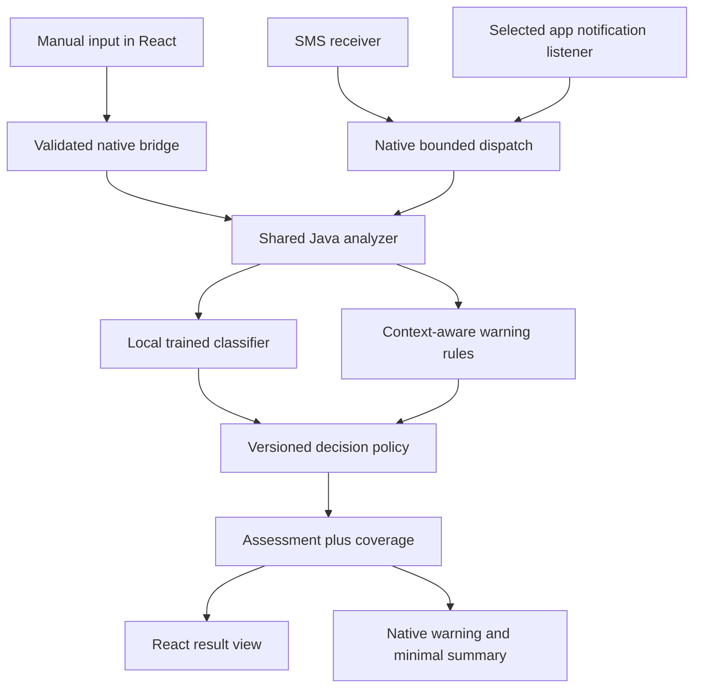

# Sane architecture and stack

Status: implementation direction established for this guidance bundle; all runtime and model
claims require validation. Read [scope](scope.md), [contracts](../sane/contracts.md),
[model](../sane/model.md), and [security](../sane/security.md) for their authoritative details.

## Stack and boundaries

| Layer                | Direction                                            | Boundary                                                                      |
| -------------------- | ---------------------------------------------------- | ----------------------------------------------------------------------------- |
| App UI               | React + Vite; TypeScript for shared UI types         | Web-rendered UI; manual input, results, monitoring controls, Learn            |
| Styling              | Existing tooling first; scoped CSS/tokens            | No new design framework required; Material-inspired behavior                  |
| Packaging            | Capacitor Android APK                                | Bundled web assets; no live remote app page                                   |
| Platform integration | Native Java                                          | SMS receiver, notification listener, warning notifications, capability status |
| Detection            | Native Java shared analyzer                          | Invoked by both UI bridge and automatic adapters independently of WebView     |
| Model development    | Python + scikit-learn                                | Supervised TF-IDF word/character features + logistic regression baseline      |
| Phone model          | Bundled vocabulary/IDF/weights/manifest              | No Python runtime, pickle, inference server, or mandatory network             |
| Local state          | Native app-private preferences and bounded summaries | Monitoring configuration and minimal alert details; no raw-body history       |

Existing root Node.js 24 tooling remains. At first app implementation, pin compatible stable
React/Vite/Capacitor/TypeScript and Python packages, Android Gradle plugin/Gradle/JDK, compile/target/min
SDK, and tested WebView versions together; record reproducible lockfiles and setup commands.
Do not install `latest` independently or silently upgrade the foundation. No toolchain matrix
has been executed yet. Choose an actual phone/Android version in TASK-101 before claiming support.

## Runtime flow

All assessable captured messages run through the model, not only messages that passed a keyword
filter. Selection filters sources, duplicates, and non-message notifications, not scam likelihood.
Run native analysis away from the main thread. Share model initialization safely and serialize
bounded work; expose overload/failure rather than silently dropping events.

SMS reception uses a manifest receiver for the appropriate protected telephony broadcast,
verifies expected action, and assembles multipart text. Validate actual permission/installer behavior.
Chat capture uses NotificationListenerService and selected package allowlists, with per-app tested
message extraction. Ignore self notifications and grouped summaries; deduplicate updates without
discarding distinct repeated messages. Do not claim message access where Android supplies none.

## Background execution decision

Start with the small local classifier and bounded native executor. For SMS, use `goAsync()`
with `finish()` in every completion/error path and a deadline comfortably inside Android's receiver
window. Capture cold-start/inference timings before accepting this path. A listener callback is
not itself a durable execution guarantee. Process death may interrupt in-memory work; report gaps.

No perpetual foreground service or periodic inbox polling is selected. If measured processing
cannot complete safely, integration must design explicit scheduled work and secure temporary storage;
WorkManager may defer even expedited jobs. Do not claim immediate alerts from scheduled work or
start a foreground service without checking current platform restrictions and consent requirements.

Force stop, reboot, OS/OEM background restrictions, permission revocation, muted chats, hidden
previews, and listener disconnection belong in device checks. Ordinary backgrounding is distinct
from force stop. Automatic monitoring cannot promise uninterrupted universal protection.

## Changes and evidence

The classifier is a baseline, not a validated best model. Architecture/model changes require
a bounded comparison, language/device evidence, security impact, and integration decision.
Neither an embedding model nor a local LLM is mandatory for the supplied theme.
An optional model upgrade cannot remove automatic monitoring or make inference cloud-dependent.

Android platform facts and sources are indexed in [security](../sane/security.md).
The first implementation slice must prove native capture plus an APK before detailed UI polish.
